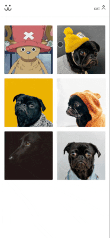

<h1 align="center">
  Dogs - Uma rede social para pets!
</h1>

## 🚀 Tecnologias
-  React
-  React Router
-  Module CSS
-  Victoria (gráficos)

## Funcionalidades
- Cadastro de usuários
- Postar fotos
- Comentários e visualizações nas fotos
- Responsivo
- Bloquear acesso a aulas ainda não disponibilizadas
- Scroll infinito
- Modal
- React Lazy Load

## ✨ Descrição

Plataforma para postar e compartilhar fotos dos seus pets! 

Tem como função utilizar de forma prática os principais conceitos do React com pouca utilização de bibliotecas externas (apenas React Router e Victory).

O projeto foi desenvolvido durante o curso de React da Origamid.

## 🌟 Preview
- Confira abaixo o preview da versão Desktop


---
- Confira abaixo o preview da versão Desktop


</p>

## 💻 Como rodar o projeto

Para funcionar adequadamente, é nescessário roda o backend do projeto feito em Wordpress, [clique aqui](https://github.com/theluanz/dogs-api-wp)

Para rodar o projeto front-end React basta clonar o repositório e rodar:

```cl
  npm install
  npm start
```
